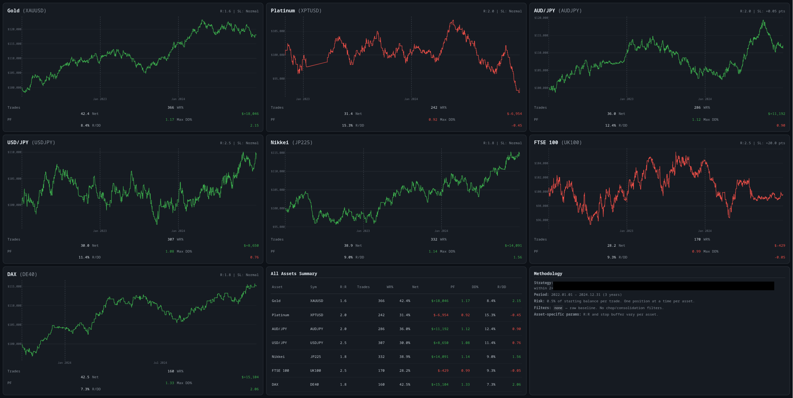
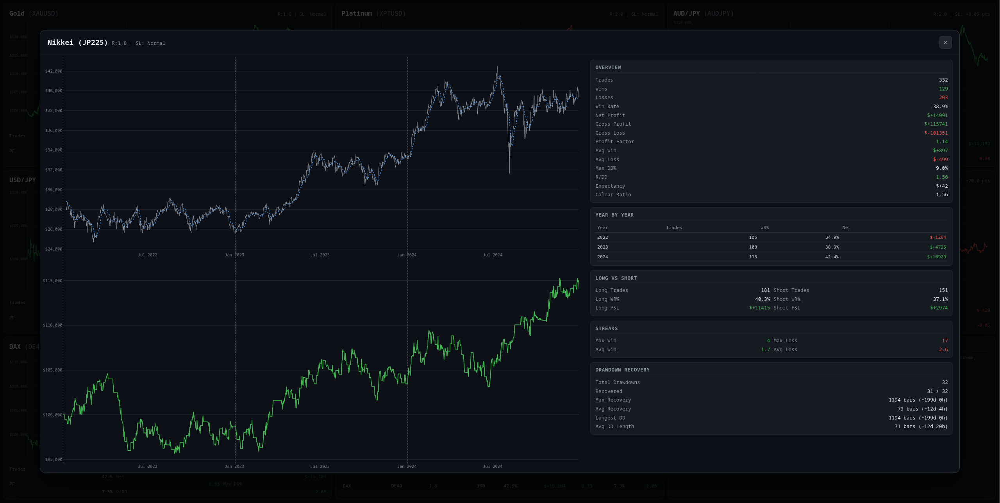

# Strategy Research Framework

A public-safe framework for a local-first trading strategy research workflow.

This repository includes the reusable research automation code, schemas, tests,
example specifications, and MT5-oriented workflow scripts. It intentionally
excludes private alpha, generated run artifacts, local databases, prompts, and
the `momentum_v1` strategy family.

## Screenshots

Sanitized result dashboards from a private baseline run. These show the
presentation and review layer only; source code, trade rules, parameter sets,
and run configs are not included.





## Architecture

The framework uses four conceptual layers:

- **Research intake:** capture a strategy idea as a structured hypothesis with
  assumptions, target market conditions, invalidation criteria, and evidence
  requirements.
- **Implementation workflow:** convert accepted hypotheses into implementation
  requests, test plans, and reproducible experiment definitions.
- **Execution and evidence:** run compile checks, backtests, sweeps, and
  validation gates in isolated output directories.
- **Review and registry:** track experiment lineage, pass/fail gates,
  robustness notes, and promotion decisions.

## Architecture & Design Decisions

The system is deliberately split into small modules rather than one end-to-end
automation script. Research intake, implementation, execution, evidence
collection, and review are separate so each layer can be debugged, replaced, or
iterated without disturbing the rest of the workflow.

Promotion is gated. A strategy should not move from idea to implementation to
candidate status just because an automated run completed. The framework keeps
human review at key points so weak evidence, overfit backtests, or brittle
parameter choices can be challenged before more time is spent on them.

The current workflow is intentionally pragmatic about AI. The strongest use so
far is not autonomous strategy discovery; many public or institutional strategy
ideas have already had their edge eroded, and naive generation tends to overfit.
The private workflow therefore uses human hypotheses and trader intuition as the
starting point, then uses AI-assisted coding, testing, summarisation, and
backtest presentation to move faster. Future work is focused on improving the
quality of agent-generated hypotheses and making the evidence gates stricter.

## Local Verification

Install the small runtime dependency, then run compile and unit-test checks:

```bash
python3 -m pip install -r requirements.txt
python3 -m compileall -q automated tests
python3 -m unittest discover -s tests -q
```

## Public Boundary

The following are deliberately not included:

- `momentum_v1` source code, rules, parameter sets, or run configs
- Raw backtest outputs, trade logs, equity curves, generated dashboards, and
  local run artifacts
- Research prompts, generated theses, and private notes
- Local databases and registry snapshots

The README screenshots are curated public examples of the result-presentation
layer. They are not runnable artifacts and do not disclose strategy logic.

## Status

This is a sanitized public code snapshot. Private strategies and research
artifacts remain separate.

## Suggested Repository Topics

`trading-research`, `research-framework`, `backtesting`, `experiment-tracking`,
`workflow-architecture`
